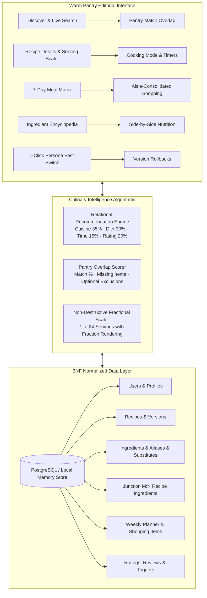

<p align="center">
  
</p>

<h1 align="center">RecipeVault</h1>

<p align="center">
  <strong>A Database-Driven Recipe Management & Culinary Intelligence System</strong><br />
  <em>Where 3NF Relational Engineering meets the editorial warmth of a handwritten family cookbook.</em>
</p>

<p align="center">
  
  
  
  
</p>

---

## 👨‍🍳 Academic & Course Context

- **Course:** Relational Database Management Systems (DBMS) & Full-Stack Culinary UI/UX Engineering
- **Engineering Authors:**
  - **Neeraj K** (`24BCE2393`) — Relational Schema Design, SQL Triggers, Views & Analytical Modeling
  - **Eric Titus** (`24BCE0096`) — Full-Stack Interface Engineering, Design System & Interactive Algorithms

---

## 🍳 System Highlights & Live Architecture



---

## 🌿 1. "Warm Pantry" Design Tokens & Atmospheric Modes

RecipeVault rejects sterile, clinical dashboards. Instead, it mirrors an artisan kitchen shelf with tactile feedback, crafted wood textures, and three automatic/manual day-night atmospheres:

| Token Name | Hex Code | Visual Application |
| :--- | :--- | :--- |
| **Cream Base** | `#FAF6F0` | Default page background — warm ivory |
| **Card White** | `#FFFDF9` | Elevation surfaces with 16–24px radius |
| **Espresso Ink** | `#2C231B` | High-contrast typography & headings |
| **Terracotta Clay** | `#C4633F` | Primary action buttons, bookmarks, active pills |
| **Muted Sage** | `#7C9070` | Pantry stock indicators, vegetarian tags, health stats |
| **Honey** | `#D9A441` | Star ratings, cooking highlights, simmer embers |
| **Linen Border** | `#E9DFD2` | Soft dividers doing more work than harsh drop shadows |

### ☀️ Atmospheric Modes (Day / Evening / Rest)
1. **Morning Dawn (`6 AM – 12 PM`)**: Bright morning light (`#F4F8F6`), fresh garden mint (`#389868`), clean marble cards.
2. **Sunset Pantry (`12 PM – 7 PM`)**: Warm afternoon sun, warm terracotta clay, amber honey.
3. **Night & Rest (`7 PM – 6 AM`)**: Deep twilight obsidian slate (`#0D121B`), zero-glare moonlit silver text (`#E3E9F2`), cozy warm hearth glow.

---

## 🗄️ 2. Relational Database Engineering (3NF)

Complete production-grade SQL scripts with full referential integrity constraints, automated rating recalculation triggers, and analytical views are provided in `src/db/`:

- [`src/db/schema.sql`](src/db/schema.sql): PostgreSQL 3NF DDL (Tables, Foreign Keys, Indexes, Triggers, Views).
- [`src/db/seed.sql`](src/db/seed.sql): Canonical culinary seed data, authentic versions, and multi-persona ratings.

### Relational Schema Summary
- **`users`**: Identity, culinary bio, skill level (`Beginner`, `Home Cook`, `Seasoned Chef`), target cooking time.
- **`recipes`**: Canonical recipe records with prep time, cook time, difficulty, visibility, servings.
- **`recipe_versions`**: Immutable revision ledger with commit summaries, author IDs, and one-click rollback.
- **`ingredients`**: Master botanical & culinary dictionary with classifications, flavor profiles, and shelf life.
- **`recipe_ingredients`**: M:N junction table mapping quantities, fractional units, and prep states (e.g. *finely diced*).
- **`ingredient_aliases`**: 1:N regional and linguistic synonyms (e.g., *Garbanzo beans / Ceci / Kabuli chana*).
- **`ingredient_substitutes`**: Self-referencing relationship mapping culinary replacements with substitution ratios.
- **`meal_plans` & `meal_plan_items`**: 7-day schedule with serving multipliers.
- **`ratings_and_reviews`**: Verified cook reviews with auto-recalculated recipe ratings via PostgreSQL trigger `trg_recipe_review_aggregate`.

---

## 🚀 3. Key Interactive Capabilities

| Feature | Description | Engineering Implementation |
| :--- | :--- | :--- |
| **Cook With What You Have** | Interactive pantry selector displaying real-time match percentages. | Set-intersection overlap algorithm calculating missing vs stocked items in $O(N)$ time. |
| **Transparent Recommendation Engine** | Multi-factor recommendation score (0–100%) explaining *why* a recipe fits. | Weighted algorithm: Cuisine Affinity (35%), Dietary Match (30%), Time Fit (15%), Ratings (20%). |
| **Non-Destructive Serving Scaler** | Scale from 1 to 24 servings dynamically. | Pure function formatting fractions (`1/2`, `1 1/4`) without mutating database records. |
| **Distraction-Free Cooking Mode** | Full-screen hands-on kitchen counter. | Step progress tracker, chef tips, duration timers, and large text for counter viewing. |
| **Aisle-Consolidated Shopping** | Aggregates all ingredients across the week's planned meals. | Categorizes by supermarket aisle (Produce, Dairy, Pantry) and checks off stocked pantry items. |
| **Artisan Wooden Ladle Cursor** | Custom teak/cherry ladle with grain inlays and brass band. | Hardware-accelerated `requestAnimationFrame` tracking with tactile downward "bang / boink" on click. |
| **1-Click Academic Persona Switcher** | Instant toggle between Eric Titus, Neeraj K, and Maya Lin. | Fast-switch for academic evaluation, review testing, and role personalization. |

---

## ⚡ 4. Performance & Engineering Standards

- **Resolution-Independent SVG Branding**: Replaced raster assets with scalable, zero-weight vector components (`RecipeVaultLogo`).
- **LCP & Image Prioritization**: Hero photography uses `loading="eager"`, `fetchPriority="high"`, and `decoding="async"` to maximize Core Web Vitals.
- **Deferred Offscreen Assets**: Grid cards and planner thumbnails use `loading="lazy"` and `decoding="async"`.
- **Zero-Lag Pointer Overlay**: Cursor physics computed on `requestAnimationFrame` without polluting the React render cycle.
- **Strict Single-Line Autolayout**: All headers, chips, and controls lock at `36px` (`h-9`) with `white-space: nowrap` and `flex-shrink: 0`.

---

## 🛠️ 5. Quickstart & Verification

```bash
# 1. Install dependencies
npm install

# 2. Launch Vite development server
npm run dev
# -> Opens http://localhost:8080

# 3. Run complete automated test suite
npm test
# -> Vitest tests 100% passing

# 4. Generate production SSR bundle
npm run build
# -> Compiles in < 1.5s
```

---

## 📂 6. Repository Layout

```
recipevault/
├── public/                # Favicons (SVG, PNG, ICO) & robots.txt
├── src/
│   ├── assets/            # High-resolution food photography
│   ├── components/        # Reusable Warm Pantry UI components
│   │   ├── recipe-vault-logo.tsx  # Vector SVG branding component
│   │   ├── wooden-ladle-cursor.tsx# Animated wooden ladle mouse pointer
│   │   ├── theme-slider.tsx       # Morning / Sunset / Night mode toggle
│   │   ├── recipe-card.tsx        # Recipe card with tuck animation & badges
│   │   ├── vault-provider.tsx     # Normalized state, auth & localStorage engine
│   │   └── vault-shell.tsx        # Persistent sidebar & autolayout top navigation
│   ├── db/
│   │   ├── schema.sql             # Complete PostgreSQL 3NF DDL
│   │   └── seed.sql               # Relational seed dataset
│   ├── lib/
│   │   ├── recipes.ts             # Relational data types & culinary math algorithms
│   │   └── metadata.ts            # SEO & OpenGraph utilities
│   ├── routes/
│   │   ├── __root.tsx             # Root layout with fonts, ladle cursor & toaster
│   │   ├── index.tsx              # Discover, recommendation scoring, pantry overlap
│   │   ├── login.tsx              # Kitchen authentication portal & 1-click personas
│   │   ├── create.tsx             # Recipe creator & immutable version commits
│   │   ├── cookbook.tsx           # Personal collections & saved recipe shelves
│   │   ├── planner.tsx            # 7-day meal matrix & consolidated shopping list
│   │   ├── ingredients.tsx        # Semantic ingredient encyclopedia & substitutes
│   │   ├── nutrition.tsx          # Side-by-side nutrition comparator & wellness FAQs
│   │   ├── profile.tsx            # Personal taste, allergen & security controls
│   │   └── recipe/$id.tsx         # Serving scaler, cooking mode & revision rollback
│   └── test/
│       ├── culinary-engine.test.ts # Math tests: scaling, pantry matching, recommendations
│       └── app-routing.test.tsx    # Routing & navigation test suite
├── DESIGN_SYSTEM.md       # "Warm Pantry" visual tokens & guidelines
├── AGENTS.md              # Lovable connection rules & architecture standards
├── roadmap.md             # Completed feature tracker
└── vite.config.ts         # Vite bundler & dependency optimization
```
